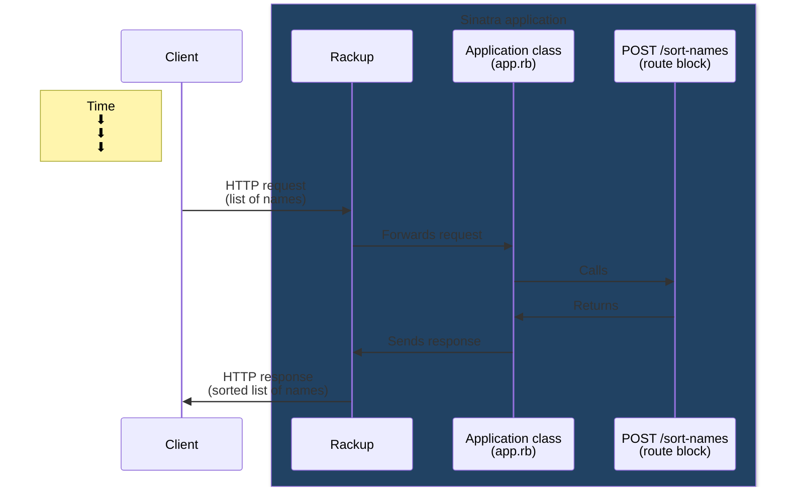

```mermaid
sequenceDiagram


participant c as Client
box rgb(33,66,99) Sinatra application
    participant r as Rackup
    participant a as Application class<br />(app.rb)
    participant p as POST /sort-names<br />(route block)
end

Note left of c: Time<br />⬇ <br /> ⬇ <br /> ⬇ 

c->>r: HTTP request<br />(list of names)
r->>a: Forwards request
a->>p: Calls
p->>a: Returns
a->>r: Sends response
r->>c: HTTP response<br />(sorted list of names)
```
