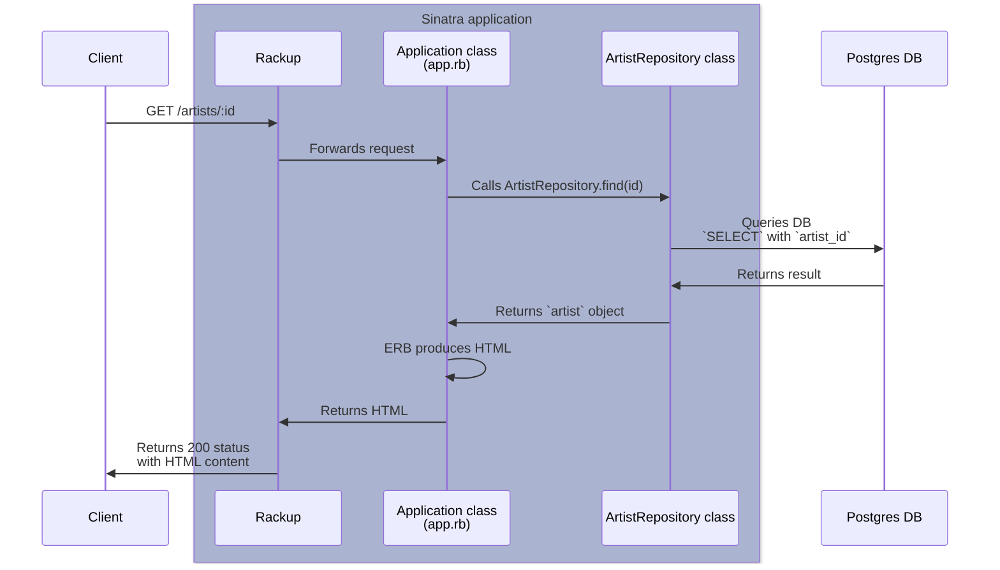

```mermaid
sequenceDiagram
participant c as Client
box rgb(170, 179, 207) Sinatra application
    participant rack as Rackup
    participant app as Application class<br />(app.rb)
    participant repo as ArtistRepository class
end
participant db as Postgres DB

c->>rack: GET /artists/:id
rack->>app: Forwards request
app->>repo: Calls ArtistRepository.find(id)
repo->>db: Queries DB<br /> `SELECT` with `artist_id`
db->>repo: Returns result
repo->>app: Returns `artist` object
app->>app: ERB produces HTML
app->>rack: Returns HTML
rack->>c: Returns 200 status<br />with HTML content

```
