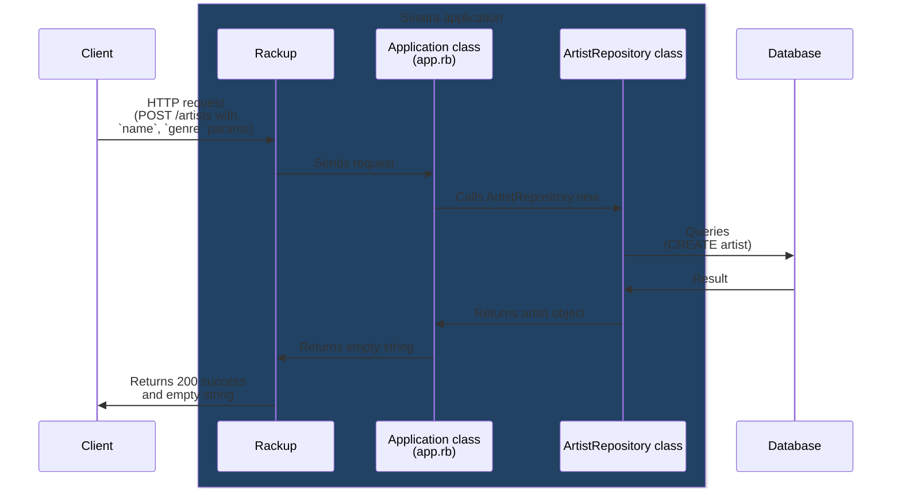

```mermaid
sequenceDiagram
participant c as Client
box rgb(33,66,99) Sinatra application
    participant r as Rackup
    participant a as Application class<br />(app.rb)
    participant repo as ArtistRepository class
end
participant db as Database

c->>r: HTTP request<br />(POST /artists with <br />`name`, `genre` params)
r->>a: Sends request
a->>repo: Calls ArtistRepository.new
repo->>db: Queries<br />(CREATE artist)
db->>repo: Result
repo->>a: Returns artist object
a->>r: Returns empty string
r->>c: Returns 200 success<br />and empty string
```
